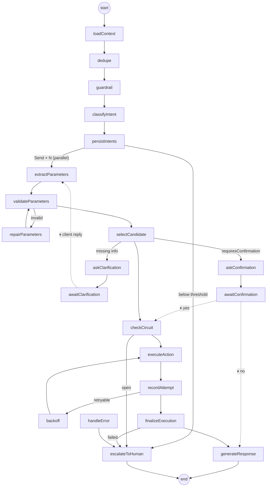

# Teddy Support

## Table of Contents <!-- omit in toc -->

- [Features](#features)
- [Deployment model](#deployment-model)
- [Intent recognition](#intent-recognition)

## Features

- [x] Database. Support [TypeORM](https://www.npmjs.com/package/typeorm) and [Mongoose](https://www.npmjs.com/package/mongoose).
- [x] Seeding.
- [x] Config Service ([@nestjs/config](https://www.npmjs.com/package/@nestjs/config)).
- [x] Mailing ([nodemailer](https://www.npmjs.com/package/nodemailer)).
- [x] Sign in and sign up via email.
- [x] Social sign in (Apple, Facebook, Google).
- [x] Admin and User roles.
- [x] Internationalization/Translations (I18N) ([nestjs-i18n](https://www.npmjs.com/package/nestjs-i18n)).
- [x] File uploads. Support local and Amazon S3 drivers.
- [x] Swagger.
- [x] E2E and units tests.
- [x] Docker.
- [x] CI (Github Actions).

## Deployment model

The app is single-tenant: each customer gets its own app instance and its own database, configured through that instance's `.env`. There is no company scoping in the code; access is controlled by the global roles (`admin` manages actions, action parameters and resources; `admin` and `user` handle clients, conversations and messages). Per-customer settings such as `INTENT_DEFAULT_CONFIDENCE_THRESHOLD` are environment variables.

## Intent recognition

Every client message runs through a [LangGraph](https://langchain-ai.github.io/langgraphjs/) state machine ([src/intent-recognition/graph](src/intent-recognition/graph/intent-graph.service.ts)) that detects what the client wants, collects the parameters, and calls the matching HTTP action.

The live diagram is served at `GET /api/v1/intent-recognition/graph` (admin only).

### Resilience

| Layer | Mechanism |
| --- | --- |
| LLM transport | SDK retries (`maxRetries`) |
| LLM model | Fallback chain `primary.withFallbacks([fallback])` (`INTENT_LLM_FALLBACK_MODEL`) |
| Graph node | `retryPolicy` with exponential backoff, only for transient errors ([transient-error.ts](src/intent-recognition/graph/transient-error.ts)), plus a per-node `timeout` |
| Node failure | Once retries are exhausted, `errorHandler` routes to `handleError` → `escalateToHuman`. Failed extraction of one candidate falls back to the next one instead |
| LLM output | Validation, then a bounded repair loop that feeds the errors back to the model |
| Action call | Explicit retry loop. It only retries when safe for the HTTP method, honors `Retry-After`, uses full-jitter backoff, and sends an `Idempotency-Key`. One `ActionExecution` row is written per attempt |
| Endpoint health | Circuit breaker built from recent `ActionExecution` rows (closed / open / half-open) |
| Reply | If the LLM reply fails, a canned reply is sent |
| Process crash / waiting for client | Postgres checkpointer (`thread_id` = conversation). `interrupt()` pauses for clarification or confirmation, and the next client message resumes the run |

### Observability and evaluation

- Per-node latency and token usage are logged for each run. Set `LANGSMITH_TRACING=true` with `LANGSMITH_API_KEY` for full traces.
- `npm run eval:intents` scores classification and extraction against [fixtures](src/intent-recognition/evals/fixtures.ts) using the real model.

