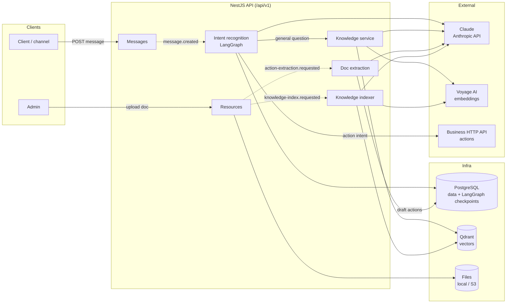
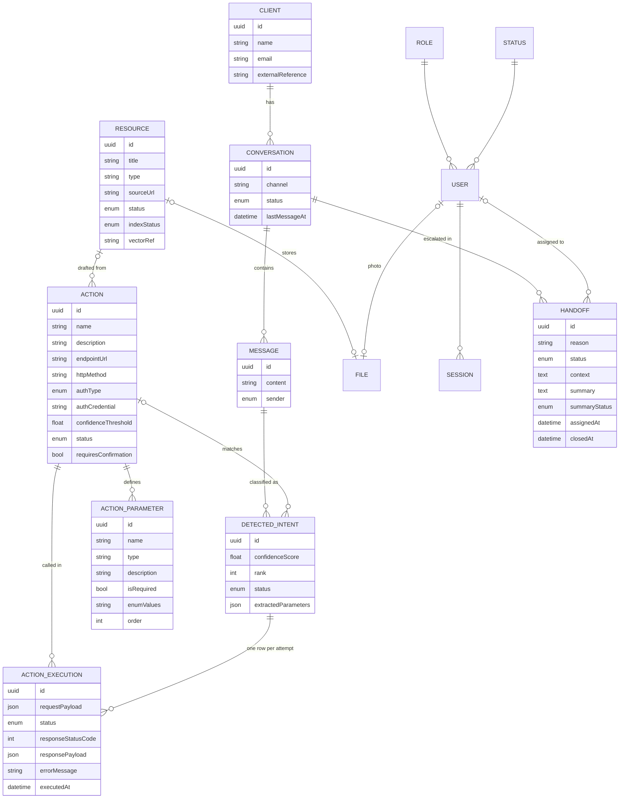
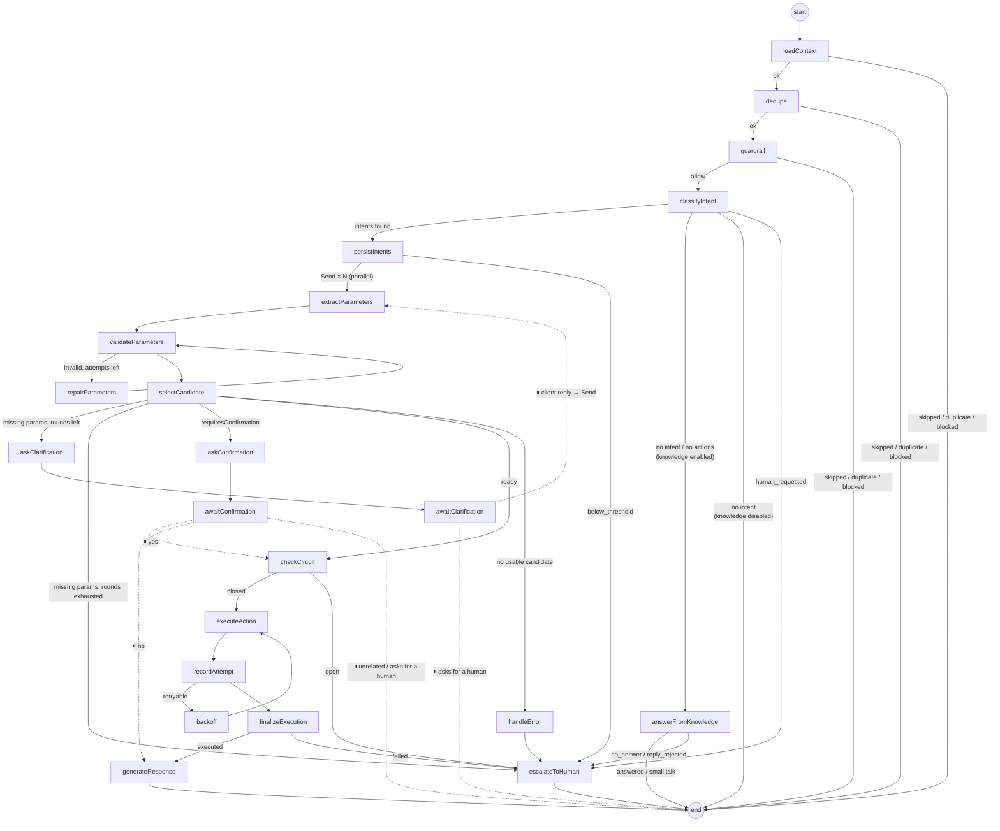
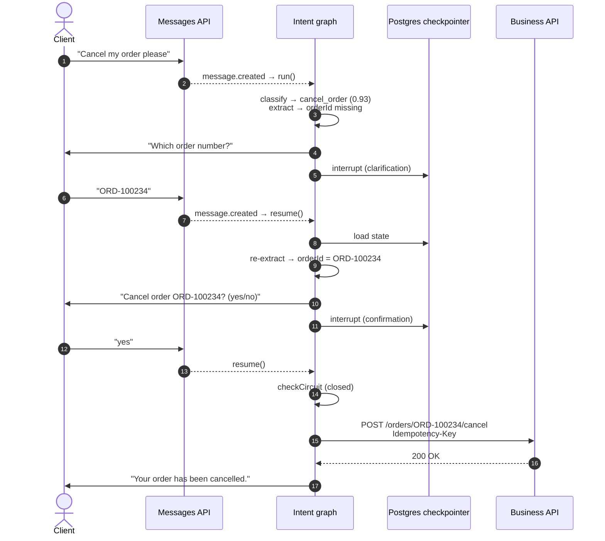
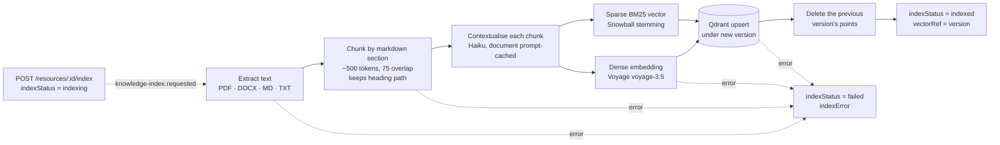
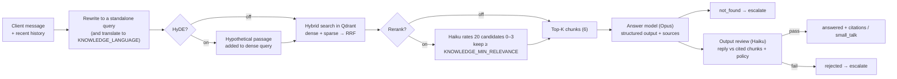

# Teddy Support

An AI customer-support backend built on NestJS. For every client message it:

1. **Works out what the client wants** and calls the matching action, an endpoint of the business's own HTTP API (for example checking an order, booking an appointment or updating account details). It collects any missing parameters and asks for confirmation when the action needs it.
2. **Answers general questions** (shipping, returns, payments…) from a help-centre knowledge base using retrieval-augmented generation (RAG), with citations.
3. **Hands the conversation to a human** when it cannot help safely.

Admins can also upload API documentation and let Claude draft the action catalog from it.

## Table of Contents <!-- omit in toc -->

- [Architecture](#architecture)
- [Deployment model](#deployment-model)
- [Domain model](#domain-model)
- [Intent recognition](#intent-recognition)
  - [How a run starts](#how-a-run-starts)
  - [Graph](#graph)
  - [Nodes](#nodes)
  - [Outcomes](#outcomes)
  - [Human in the loop](#human-in-the-loop)
  - [Resilience](#resilience)
- [Knowledge base (RAG)](#knowledge-base-rag)
  - [Indexing](#indexing)
  - [Answering](#answering)
  - [Output guardrail](#output-guardrail)
- [Action extraction from API docs](#action-extraction-from-api-docs)
- [Privacy](#privacy)
- [Rate limiting and cost budget](#rate-limiting-and-cost-budget)
- [REST API](#rest-api)
- [Getting started](#getting-started)
- [Configuration](#configuration)
- [Evaluation and testing](#evaluation-and-testing)
- [Boilerplate features](#boilerplate-features)

## Architecture



 
## Deployment model

The app is single-tenant: each customer gets its own app instance and its own database, configured through that instance's `.env`. Nothing in the code is scoped by company. Access is controlled by the global roles:

- `admin` manages actions, action parameters and resources.
- `admin` and `user` handle clients, conversations and messages.

Per-customer settings such as `INTENT_DEFAULT_CONFIDENCE_THRESHOLD` are environment variables.

## Domain model




Action credentials are never put into LLM prompts. The catalog given to the model has them stripped, and they are loaded just in time when the action is executed.

## Intent recognition

Every client message runs through a [LangGraph](https://langchain-ai.github.io/langgraphjs/) state machine ([src/intent-recognition/graph](src/intent-recognition/graph/intent-graph.ts)). The graph detects what the client wants, collects the parameters and calls the matching HTTP action. If the message matches no action, the graph answers it from the knowledge base instead.

### How a run starts

- Creating a message emits `message.created`. The listener only reacts to `client` messages, and only when `INTENT_RECOGNITION_ENABLED=true`.
- Client messages are debounced per conversation: a burst ("hi", "my order", "ORD-1") sent within `INTENT_DEBOUNCE_MS` of each other is processed as one run, never later than `INTENT_DEBOUNCE_MAX_WAIT_MS` after the first message. The burst is joined into one message for the guardrail and classification, and detected intents link to the latest message.
- Runs for the same conversation are serialised by a per-conversation lock.
- The LangGraph thread is the conversation (`thread_id = conversationId`). If the previous run is paused waiting for the client (clarification or confirmation) and has not expired (`INTENT_PENDING_INPUT_TTL_MS`), the new message **resumes** it. Otherwise a fresh run starts. If the client changed the subject instead of answering a confirmation, the resumed run ends as `superseded` and a fresh run handles the message.

### Graph



Any node whose retries run out routes to `handleError`. The live diagram, generated from the compiled graph, is served at `GET /api/v1/intent-recognition/graph` (admin only).

### Nodes

| Node | Kind | Purpose |
| --- | --- | --- |
| `loadContext` | IO | Loads the message, the recent history (`INTENT_HISTORY_LIMIT`) and the catalog of active actions and their parameters, with credentials stripped |
| `dedupe` | IO | Stops if this message already has detected intents |
| `guardrail` | LLM | Prompt-injection screen: a regex pre-check, then an LLM verdict. Anything other than `allow` sets `blocked`. Can be turned off with `INTENT_GUARDRAIL_ENABLED=false` |
| `classifyIntent` | LLM | Ranks up to `INTENT_MAX_CANDIDATES` matching actions with a confidence score. General questions get no candidates. An explicit request for a human sets `human_requested` (see [Escalation on request](#escalation-on-request)) |
| `persistIntents` | IO | Saves one `DetectedIntent` per candidate and compares each with its threshold (the action's `confidenceThreshold`, or the default) |
| `extractParameters` | LLM, fan-out | Extracts parameters for every candidate above its threshold, in parallel, so the next candidate is ready as a fallback |
| `validateParameters` | pure | Validates the extracted values against each parameter's type, required flag and enum values |
| `repairParameters` | LLM | Re-runs extraction with the validation errors fed back (`INTENT_MAX_REPAIR_ATTEMPTS`) |
| `selectCandidate` | IO | Picks the best-ranked extraction that succeeded and works out which parameters are missing |
| `askClarification` / `awaitClarification` | IO + ⏸ | Asks for the missing parameters and pauses with `interrupt()` (`INTENT_MAX_CLARIFICATION_ROUNDS`). A reply asking for a human ends the run as `superseded` |
| `askConfirmation` / `awaitConfirmation` | IO + ⏸ | For actions with `requiresConfirmation`: asks the client and pauses, then parses yes, no or unrelated |
| `checkCircuit` | IO | Circuit breaker built from recent `ActionExecution` rows |
| `executeAction` → `recordAttempt` → `backoff` | IO | Makes the HTTP call with an `Idempotency-Key`, writes one row per attempt and retries with jittered backoff |
| `finalizeExecution` | IO | Sets `executed` or `execution_failed` |
| `generateResponse` | LLM | Writes the reply to the client from the action result, then runs the [output guardrail](#output-guardrail) on it. If the LLM fails or the reply is rejected, a canned reply is sent instead |
| `answerFromKnowledge` | LLM | Runs the [RAG pipeline](#answering) and replies with citations, or sets `no_answer` (nothing found) or `reply_rejected` (the answer failed the [output guardrail](#output-guardrail)) |
| `handleError` / `escalateToHuman` | IO | Marks the intent `failed` or `escalated`, sends a hand-off message and opens a [hand-off](#human-hand-off) |

Nodes live in [src/intent-recognition/graph/nodes](src/intent-recognition/graph/nodes/) and prompts in [src/intent-recognition/prompts](src/intent-recognition/prompts/).

### 
`budget_exceeded` is used only as a hand-off reason: the listener checks the [cost budget](#rate-limiting-and-cost-budget) before a run and does not start the graph.

### Human in the loop

The run pauses with `interrupt()` and its state is checkpointed in Postgres (schema `langgraph`). The client's next message resumes it, even after the process restarts. The example below uses the e-commerce seed data.



### Resilience

| Layer | Mechanism |
| --- | --- |
| LLM transport | SDK retries (`maxRetries`) |
| LLM model | Fallback chain `primary.withFallbacks([fallback])` (`INTENT_LLM_FALLBACK_MODEL`) |
| Graph node | `retryPolicy` with exponential backoff, only for transient errors ([transient-error.ts](src/intent-recognition/graph/transient-error.ts)), plus a per-node `timeout` (`INTENT_LLM_NODE_TIMEOUT_MS`) |
| Node failure | Once retries run out, `errorHandler` routes to `handleError` → `escalateToHuman`. If extraction fails for one candidate, the next candidate is used instead |
| LLM output | Zod structured output and validation, then a bounded repair loop that feeds the errors back to the model |
| Action call | Explicit retry loop. It only retries when the HTTP method makes that safe, honors `Retry-After`, uses full-jitter backoff and sends an `Idempotency-Key`. One `ActionExecution` row is written per attempt |
| Endpoint health | Circuit breaker built from recent `ActionExecution` rows (closed, open or half-open; `INTENT_CIRCUIT_*`) |
| Knowledge | If the knowledge base cannot answer (`no_answer`), the conversation goes to a human |
| Reply | If the LLM reply fails, a canned reply is sent |
| Process crash / waiting for client | Postgres checkpointer (`thread_id` = conversation). `interrupt()` pauses for clarification or confirmation, and the next client message resumes the run |

Newer Claude models (Opus 4.7+, Sonnet 5, Fable 5, …) only support adaptive sampling. [anthropic-models.ts](src/utils/anthropic-models.ts) handles this centrally: these models get no `temperature` and use `jsonSchema` structured output instead of forced tool calls.

## Knowledge base (RAG)

[src/knowledge](src/knowledge/) turns help-centre documents (Resources with a file attached) into a searchable knowledge base. The intent graph uses it when a message is a general question rather than an action request.

Stack: **Voyage AI** embeddings, **Qdrant** hybrid search (dense + BM25 sparse, RRF fusion), **Claude Haiku** for query rewriting, contextual chunks and reranking, and **Claude Opus** for the final answer.

### Indexing



- Each chunk is embedded as `Title > Heading > …` + its generated context + the chunk text.
- Re-indexing writes a new version before deleting the old one, so the resource always has searchable chunks.
- `DELETE /resources/:id/index` removes the resource's points and clears its index fields.
- Changing `KNOWLEDGE_EMBEDDING_MODEL` or `KNOWLEDGE_EMBEDDING_DIMENSION` requires re-indexing everything.

### Answering



`POST /api/v1/knowledge/query` (admin) runs the same pipeline outside a conversation. It accepts the per-request switches `hybrid`, `hyde` and `rerank` and returns every intermediate step: rewritten query, candidates, contexts, chunks and latency. The RAG evals and ablations use it.

### Output guardrail

Incoming messages are screened by the `guardrail` node; outgoing LLM replies are checked by an output review ([output-review.ts](src/utils/output-review.ts)) before they are sent. A fast model (Haiku) gets the draft reply, the customer's message and the reference the reply was written from, and returns `pass`, `ungrounded` (a claim the reference does not support) or `policy_violation`. The policy forbids promising refunds, discounts or deadlines the reference does not offer, asking for passwords or card codes, revealing internals or other customers' data, links or contacts not in the reference, legal, medical or financial advice, and rude or off-topic content.

- *Knowledge answers*: the reference is the chunks the answer cites. A rejected answer gets the status `rejected`, is not sent, and the conversation is handed over to a human (`reply_rejected`). `POST /knowledge/query` returns the verdict as `review`. Small talk is reviewed too, with no reference, so it must not state facts about the company. Turn it off with `KNOWLEDGE_OUTPUT_GUARDRAIL_ENABLED=false`.
- *Action replies*: the reference is the action, its parameters and its result. The action has already run, so a rejected reply is replaced with the canned confirmation instead of being handed over. Turn it off with `INTENT_OUTPUT_GUARDRAIL_ENABLED=false`.

The reviewer is told to flag only clear problems, so it costs one Haiku call per reply and rarely blocks good answers. The verdict and its reason are logged with PII placeholders.

## Action extraction from API docs

Admins attach an API document (PDF or DOCX) to a Resource. [src/doc-extraction](src/doc-extraction/) asks Claude (`DOC_EXTRACTION_MODEL`) to read it with structured output and drafts the action catalog from it: name, method, URL, auth type, confirmation flag and typed parameters.


Extracted actions are saved with status `draft`. An admin reviews them, adds credentials and sets them to `active` before the intent graph can use them. Re-running extraction replaces earlier drafts and leaves active actions alone.

## Human hand-off

When the graph escalates, `escalateToHuman` opens a `Handoff` (reason = the run's outcome) and sets the conversation to `escalated`. Client messages to an `escalated` or `assigned` conversation do not run the bot. A client message to a `resolved` conversation reopens it for the bot.

### Escalation on request

A client who asks for a human ("I want to talk to a person", "połącz mnie z konsultantem", "ich möchte mit einem Mitarbeiter sprechen") is handed off with reason `human_requested`, whether or not the knowledge base is enabled or any actions exist. Detection has two layers:

1. Conservative EN/PL/DE patterns ([human-request.prompt.ts](src/intent-recognition/prompts/human-request.prompt.ts)), checked in `classifyIntent` before the LLM call. A match costs no LLM call.
2. A `humanRequested` flag on the classification output catches paraphrases. Frustration alone does not set it, and an explicit request wins over any matched action.

A pattern match in a reply to a pending clarification or confirmation question ends that run as `superseded`, so the message is processed again from scratch and escalates.

Each hand-off stores two things for the agent:

- `context`: facts the graph already had (top action and confidence, extracted and missing parameters, failed executions, knowledge query, error), copied verbatim.
- `summary`: written in the background by Haiku (`HANDOFF_SUMMARY_MODEL`) from the last `HANDOFF_SUMMARY_HISTORY_LIMIT` messages. It contains the goal, what was tried, open questions, a suggested next step, sentiment and language. `summaryStatus` is `pending`, `ready` or `failed`.


Only the assignee or an admin can reply, release or resolve an assigned hand-off. Agents can only assign themselves; admins can assign anyone. A conversation has at most one active hand-off, so escalating again returns the existing one.

## Privacy

Code in [src/privacy](src/privacy/).

**PII redaction.** [PiiRedactor](src/privacy/pii/pii-redactor.ts) detects emails, card numbers (13-19 digits that pass the Luhn check) and phone numbers (international, or grouped like `600-700-800`). A bare run of digits is not treated as a phone, because it is more likely an order number.

- *LLM calls*: every intent, knowledge and hand-off call is wrapped. Before the call, PII in the prompt is replaced with numbered placeholders (`[EMAIL_1]`). Afterwards the real values are put back into the output, so extracted parameters, replies and summaries still carry them. System prompts are not changed. The rewritten search query and the HyDE passage keep their placeholders, because they are sent on to Voyage for embedding.
- *Logs*: the Nest logger ([RedactingLogger](src/privacy/pii/redacting-logger.ts)) and the TypeORM query log mask PII as `[EMAIL]`, `[CARD]` and `[PHONE]`. This covers error messages and stack traces.
- *Not covered*: the database stores messages, extracted parameters and action payloads unredacted, and the business's action endpoints receive the real values. LangSmith traces of a graph run include the raw state; set `LANGSMITH_HIDE_INPUTS=true` / `LANGSMITH_HIDE_OUTPUTS=true` to keep them out. Action extraction runs on the business's own API docs and is not redacted.

**GDPR erasure.** `DELETE /clients/:id/personal-data` (admin only) deletes the client with all their conversations, messages, detected intents, action executions and hand-offs in one transaction. It also deletes the intent graph checkpoints, which hold message content. The response reports how many rows were deleted per table.

**Retention.** If `DATA_RETENTION_DAYS` is set, the app deletes conversations with no activity for that many days in the same way: on boot, then every `DATA_RETENTION_INTERVAL_MINUTES`. Conversations that are `escalated` or `assigned` are kept until an agent closes them. Client profiles that have no conversations left and have not been updated within the window are deleted too.

## Rate limiting and cost budget

**Rate limiting.** [AppThrottlerGuard](src/rate-limit/app-throttler.guard.ts) (`@nestjs/throttler`) is a global guard with three limits that share one window (`RATE_LIMIT_TTL_MS`):

- *Per IP*: every route, counted separately per route (`RATE_LIMIT_IP_LIMIT`).
- *Per conversation*: messages posted to one conversation (`RATE_LIMIT_CONVERSATION_LIMIT`).
- *Per client*: messages across all conversations of the conversation's client (`RATE_LIMIT_CLIENT_LIMIT`). Conversations without a client are limited per conversation only.

The per-conversation and per-client limits apply only to routes marked with `@ThrottleByConversation()`, which today is `POST /messages`. A request over a limit gets `429` with a `Retry-After` header. The guard runs before authentication, so it cannot key on the user. Counters are kept in memory, per instance; with several replicas, plug in a shared `ThrottlerStorage` such as Redis. Behind a proxy, the per-IP limit needs Express `trust proxy` to see the real client IP.

**Cost budget.** Every graph run sums its LLM token usage, including fallback-model and knowledge base calls, and prices each call by the model that served it ([anthropic-models.ts](src/utils/anthropic-models.ts): first-party list prices, cache reads at 0.1× and writes at 1.25×; unknown models are priced at the top tier). The usage is added atomically to `conversation.llmInputTokens`, `llmOutputTokens` and `llmCostUsd`, failed runs included. When `INTENT_CONVERSATION_BUDGET_USD` is set, the listener checks the spend before each run. Once the spend reaches the budget, the next client message gets a short bot reply and the conversation is [handed off](#human-hand-off) with reason `budget_exceeded` instead of running the graph. The check happens before a run, so a single run can go over the budget. Hand-off summaries and action extraction are not counted.

## REST API

All routes are under `/api/v1` and documented with Swagger at `/docs`. Authentication uses email + password with JWT access and refresh tokens.

| Route | Roles | Notes |
| --- | --- | --- |
| `/auth/*` | public / JWT | Register, confirm email, login, refresh, forgot and reset password, `me` |
| `/clients`, `/conversations`, `/messages` | admin, user | CRUD. Creating a message triggers intent recognition and is [rate limited](#rate-limiting-and-cost-budget) per conversation and client |
| `DELETE /clients/:id/personal-data` | admin | GDPR erasure of a client and everything recorded about them |
| `/handoffs` | admin, user | Agent inbox. `GET /handoffs?status=pending&assignee=me`, `POST /handoffs` (manual escalation), `POST /handoffs/:id/assign\|messages\|release\|resolve\|summary` |
| `/actions`, `/action-parameters` | admin | Action catalog. `GET /actions?status=draft&resourceId=…` |
| `/detected-intents`, `/action-executions` | admin | Audit trail of what the bot detected and called |
| `/resources` | admin | Documents that feed doc extraction and the knowledge base |
| `POST /resources/:id/extract-actions` | admin | Starts action extraction (202) |
| `POST` / `DELETE /resources/:id/index` | admin | Indexes or removes a document in the knowledge base |
| `POST /knowledge/query` | admin | Runs the RAG pipeline directly |
| `GET /intent-recognition/graph` | admin | Mermaid source of the live graph |
| `/users` | admin | User management |
| `/files/upload` | JWT | Local, S3 or S3-presigned driver (`FILE_DRIVER`) |

## Getting started

Prerequisites: Node (see `.nvmrc`) and Docker. An Anthropic API key is required for the LLM features, and a Voyage API key for the knowledge base.

```bash
cp env-example-relational .env
# set DATABASE_HOST=localhost, MAIL_HOST=localhost for running the API outside Docker
# set ANTHROPIC_API_KEY, INTENT_RECOGNITION_ENABLED=true
# set VOYAGE_API_KEY, KNOWLEDGE_ENABLED=true

docker compose up -d postgres qdrant maildev adminer
npm install
npm run migration:run
npm run seed:run:relational
npm run start:dev           # http://localhost:3001/docs
```

To run the whole stack in Docker (migrations, seed and API): `docker compose up -d`.

**Seed data** (an example e-commerce platform; the actions and documents are just demo content):

- Users: `admin@example.com` (admin) and `john.doe@example.com` (user), both with password `secret`.
- 13 e-commerce actions with parameters, such as `check_order_status`, `track_shipment`, `cancel_order` (needs confirmation), `request_return` and `validate_discount_code`. They call `SEED_SHOP_API_URL` (httpbin by default).
- 4 clients with conversation history.
- 6 help-centre documents ([docs](src/database/seeds/relational/resource/docs/)): shipping, returns, payment methods, size guide, promotions and terms. Index each one with `POST /api/v1/resources/:id/index`.

**Chat playground.** Talk to the bot in the terminal against the seeded database:

```bash
npm run chat                                  # new conversation
npm run chat -- mark.schmidt@example.com      # latest conversation of a seeded client
npm run chat -- <conversationId> "where is my order ORD-100234?"
```

After each reply the playground prints the outcome, the intent, its parameters, the action call and knowledge sources, the node path, latency and token usage. Commands: `/history`, `/new`, `/quit`.

## Configuration

All settings come from `.env` (see [env-example-relational](env-example-relational)).

**Intent recognition** ([intent-recognition.config.ts](src/intent-recognition/config/intent-recognition.config.ts))

| Variable | Default | Purpose |
| --- | --- | --- |
| `INTENT_RECOGNITION_ENABLED` | `false` | Turns the graph on |
| `ANTHROPIC_API_KEY` | — | Shared by all LLM features |
| `INTENT_LLM_MODEL` / `INTENT_LLM_FALLBACK_MODEL` | `claude-haiku-4-5-20251001` / — | Primary and fallback model |
| `INTENT_DEFAULT_CONFIDENCE_THRESHOLD` | `0.7` | Used when an action has no own threshold |
| `INTENT_MAX_CANDIDATES` | `3` | Ranked candidates per message |
| `INTENT_HISTORY_LIMIT` | `20` | Messages of context |
| `INTENT_GUARDRAIL_ENABLED` | `true` | Prompt-injection screen |
| `INTENT_OUTPUT_GUARDRAIL_ENABLED` | `true` | [Output review](#output-guardrail) of action replies |
| `INTENT_LLM_NODE_TIMEOUT_MS` | `30000` | Per-node timeout for LLM nodes |
| `INTENT_MAX_REPAIR_ATTEMPTS` / `INTENT_MAX_CLARIFICATION_ROUNDS` | `2` / `2` | Loop bounds |
| `ACTION_EXECUTION_TIMEOUT_MS` | `10000` | HTTP timeout per action call |
| `INTENT_MAX_EXECUTION_ATTEMPTS`, `INTENT_EXECUTION_BACKOFF_BASE_MS`, `INTENT_EXECUTION_MAX_BACKOFF_MS` | `3`, `500`, `10000` | Action retries |
| `INTENT_CIRCUIT_WINDOW_MS`, `_FAILURE_RATE`, `_MIN_CALLS`, `_COOLDOWN_MS` | `300000`, `0.5`, `5`, `30000` | Circuit breaker |
| `INTENT_CHECKPOINTER` | `postgres` | `postgres` or `memory` |
| `INTENT_PENDING_INPUT_TTL_MS` | `86400000` | How long a paused run can be resumed |
| `INTENT_DEBOUNCE_MS`, `INTENT_DEBOUNCE_MAX_WAIT_MS` | `1500`, `5000` | Message debounce window and its cap (`0` disables it) |
| `INTENT_CONVERSATION_BUDGET_USD` | — | Estimated LLM spend after which a conversation is [handed off](#rate-limiting-and-cost-budget) (unset means no budget) |

**Knowledge base** ([knowledge.config.ts](src/knowledge/config/knowledge.config.ts))

| Variable | Default | Purpose |
| --- | --- | --- |
| `KNOWLEDGE_ENABLED` | `false` | Routes unmatched messages to RAG |
| `VOYAGE_API_KEY` | — | Embeddings |
| `QDRANT_URL`, `QDRANT_API_KEY`, `KNOWLEDGE_COLLECTION` | `http://localhost:6333`, —, `knowledge` | Vector store |
| `KNOWLEDGE_EMBEDDING_MODEL`, `KNOWLEDGE_EMBEDDING_DIMENSION` | `voyage-3.5`, `1024` | Changing either requires re-indexing |
| `KNOWLEDGE_LANGUAGE` | — | Snowball stemmer language. Queries are translated into it |
| `KNOWLEDGE_FAST_MODEL` | `claude-haiku-4-5` | Rewrite, HyDE, contextual chunks, rerank |
| `KNOWLEDGE_ANSWER_MODEL`, `KNOWLEDGE_ANSWER_EFFORT`, `KNOWLEDGE_ANSWER_MAX_TOKENS` | `claude-opus-5-5`, `medium`, `4000` | Answer generation |
| `KNOWLEDGE_CHUNK_TOKENS`, `KNOWLEDGE_CHUNK_OVERLAP_TOKENS`, `KNOWLEDGE_CONTEXTUAL_CHUNKS` | `500`, `75`, `true` | Chunking |
| `KNOWLEDGE_PREFETCH_LIMIT`, `KNOWLEDGE_RERANK_CANDIDATES`, `KNOWLEDGE_TOP_K`, `KNOWLEDGE_MIN_RELEVANCE` | `40`, `20`, `6`, `2` | Retrieval sizes |
| `KNOWLEDGE_RERANK_ENABLED`, `KNOWLEDGE_HYDE_ENABLED` | `true`, `false` | Pipeline switches |
| `KNOWLEDGE_HISTORY_LIMIT` | `6` | Turns used for query rewriting |
| `KNOWLEDGE_OUTPUT_GUARDRAIL_ENABLED` | `true` | [Output review](#output-guardrail) of answers against their cited chunks |

**Privacy** ([privacy.config.ts](src/privacy/config/privacy.config.ts)): `PII_REDACTION_ENABLED` (`true`), `DATA_RETENTION_DAYS` (unset, so data is kept forever), `DATA_RETENTION_INTERVAL_MINUTES` (`60`).

**Rate limiting** ([rate-limit.config.ts](src/rate-limit/config/rate-limit.config.ts)): `RATE_LIMIT_TTL_MS` (`60000`), `RATE_LIMIT_IP_LIMIT` (`300`), `RATE_LIMIT_CONVERSATION_LIMIT` (`20`), `RATE_LIMIT_CLIENT_LIMIT` (`60`). `0` disables a limit.

**Doc extraction**: `DOC_EXTRACTION_MODEL` (`claude-sonnet-5-5`), `DOC_EXTRACTION_MAX_TOKENS` (`16000`).

**Tracing**: `LANGSMITH_TRACING=true`, `LANGSMITH_API_KEY`, `LANGSMITH_PROJECT`.

App, database, mail, file storage and auth settings are listed in [env-example-relational](env-example-relational).

## Evaluation and testing

| Command | What it checks |
| --- | --- |
| `npm run eval:intents` | Classification and parameter extraction against [fixtures](src/intent-recognition/evals/fixtures.ts), using the real model |
| `cd evals/rag && npm run eval` | RAG quality with [promptfoo](https://promptfoo.dev) against the running API |
| `cd evals/rag && npm run eval:ablations` | The same goldens across `baseline`, `rerank-off`, `dense-only` and `hyde-on` |
| `npm test` | Unit tests (graph routing and service, circuit breaker, executor, chunker, retriever, vector store, sparse encoder, doc extraction, …) |
| `npm run test:e2e` | E2E tests for auth and users |

The RAG evals ([evals/rag](evals/rag/README.md)) use 27 golden cases: single questions, follow-ups, Polish and German, out-of-scope and small talk. They score contextual precision, context recall, context relevance, faithfulness and answer relevance, with Claude Sonnet as the judge. `npm run synthesize -- <docs_dir>` drafts new goldens from markdown docs.

Observability: the latency and token usage of each node are logged for every run. Set `LANGSMITH_TRACING=true` for full traces.

CI ([.github/workflows/docker-e2e.yml](.github/workflows/docker-e2e.yml)) builds the Docker stack, runs migrations and seeds, lints and runs the E2E suite on every push and PR to `main`.

## Boilerplate features

- [x] PostgreSQL with [TypeORM](https://www.npmjs.com/package/typeorm), migrations and seeding.
- [x] Code generators for resources and properties (`npm run generate:resource:relational`, `npm run add:property:to-relational`).
- [x] Config Service ([@nestjs/config](https://www.npmjs.com/package/@nestjs/config)).
- [x] Mailing ([nodemailer](https://www.npmjs.com/package/nodemailer)) with Maildev for development.
- [x] Sign in and sign up via email, JWT access and refresh tokens, sessions.
- [x] Admin and User roles.
- [x] Internationalization ([nestjs-i18n](https://www.npmjs.com/package/nestjs-i18n)).
- [x] File uploads with local, Amazon S3 and S3-presigned drivers.
- [x] Swagger.
- [x] Unit and E2E tests.
- [x] Docker and CI (GitHub Actions).
- [ ] Social sign-in: the interfaces exist, but no provider modules are wired.
